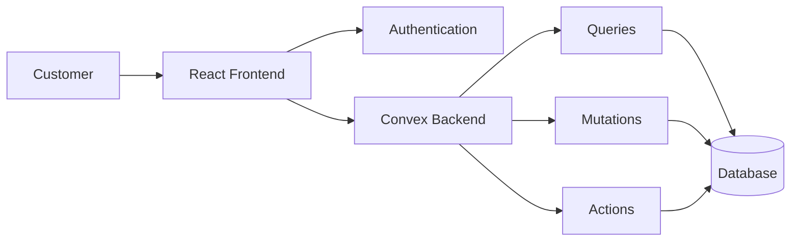

# 🛍️ DukaanKonnect

> A modern full-stack service marketplace that connects customers with trusted local service providers.

DukaanKonnect simplifies service discovery, booking, and provider management through a seamless and responsive platform built with modern web technologies.

---

## 🚀 Live Demo

🔗 **Coming Soon**

---

## 📌 Problem Statement

Finding reliable local service providers is often time-consuming and inefficient. Customers struggle to compare providers, while professionals lack a centralized platform to reach potential clients.

**DukaanKonnect** bridges this gap by offering a marketplace where users can discover, connect with, and book verified service providers effortlessly.

---

## ✨ Key Features

### 👤 Customer Features

- Secure Authentication
- Browse Available Services
- Search & Filter Providers
- Service Booking System
- Provider Profiles
- Booking History
- Responsive User Experience

### 🛠️ Provider Features

- Professional Service Profiles
- Service Management
- Booking Request Handling
- Availability Management
- Customer Interaction

### 🔒 Security Features

- Convex Authentication
- Protected Routes
- Session Management
- Authorization Checks
- Secure Database Operations

---

## 🏗️ Tech Stack

### Frontend

- React 19
- TypeScript
- Vite
- Tailwind CSS v4
- Shadcn UI
- React Router v7
- Framer Motion
- Three.js
- Lucide React

### Backend

- Convex
- Convex Auth
- Convex Database

### Development Tools

- pnpm
- ESLint
- TypeScript

---

## 🏛️ System Architecture



---

## 📂 Project Structure

```text
src/
├── components/
│   └── ui/
├── pages/
├── hooks/
├── convex/
├── lib/
├── assets/
└── main.tsx
```

---

## ⚙️ Installation

### Clone Repository

```bash
git clone https://github.com/viveks-002/DukaanKonnect-app.git
```

### Move Into Project

```bash
cd DukaanKonnect-app
```

### Install Dependencies

```bash
pnpm install
```

### Start Development Server

```bash
pnpm dev
```

---

## 🔑 Environment Variables

Create a `.env.local` file:

```env
CONVEX_DEPLOYMENT=your_convex_deployment
VITE_CONVEX_URL=your_convex_url
```

---

## 📸 Screenshots

### Landing Page


### Service Marketplace


### Provider Dashboard


---

## 🎯 Future Enhancements

- 💳 Payment Gateway Integration (Stripe / Razorpay)
- ⭐ Ratings & Reviews
- 🤖 AI-Powered Recommendations
- 📍 Location-Based Matching
- 💬 Real-Time Chat System
- 🔔 Push Notifications
- 📊 Analytics Dashboard

---

## 📈 Learning Outcomes

This project helped in gaining hands-on experience with:

- Full Stack Development
- Authentication & Authorization
- Real-Time Databases
- State Management
- Responsive UI Design
- Modern React Architecture
- Cloud-Based Backend Development

---


## ⭐ Support

If you found this project helpful, consider giving it a **Star ⭐** on GitHub.

---

### Made with ❤️ using React, TypeScript & Convex
